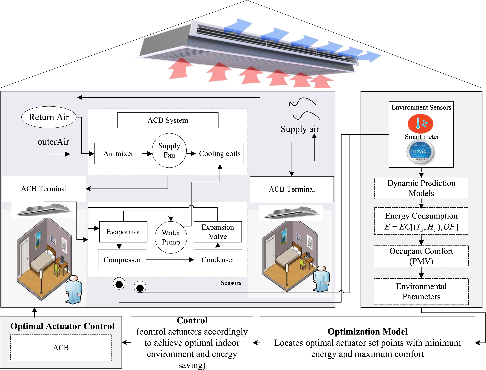
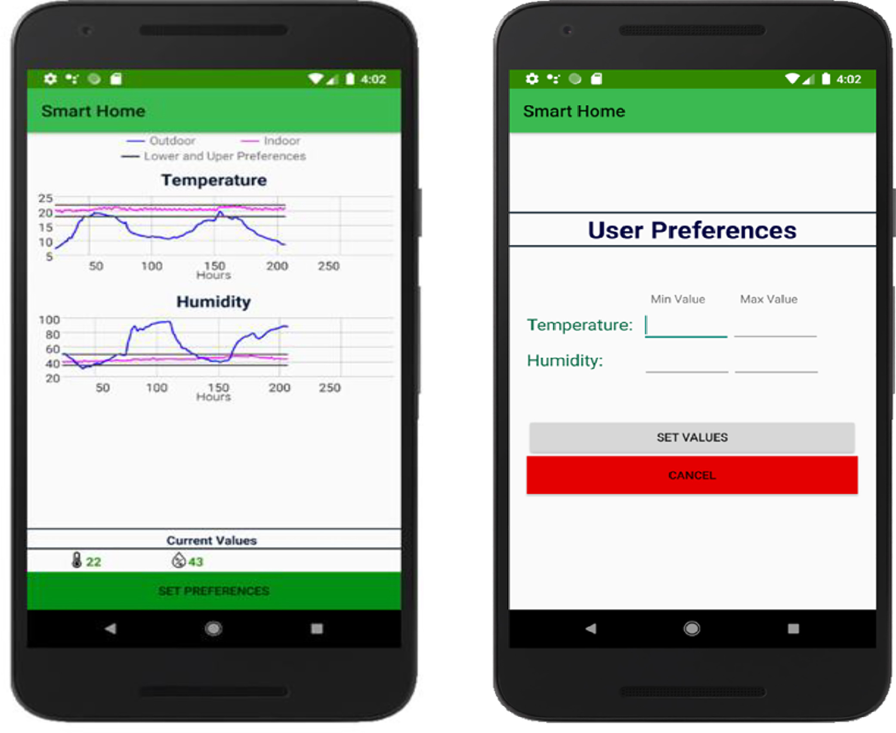

# OCF-IoTivity Smart Home Energy & Comfort Optimization System

[](http://creativecommons.org/licenses/by-nc-nd/4.0/)
[](https://www.python.org/downloads/)
[](https://iotivity.org/)
[](https://www.java.com/)

An Open Connectivity Foundation (OCF) based prediction-assisted optimal control framework for smart homes that optimizes energy consumption while maximizing occupant thermal comfort. This is the **first scalable, secure, and interoperable optimal control solution** for smart-home IoT networks.

## 🌟 Key Achievements

- **36.82% Energy Savings** - Significant reduction in HVAC energy consumption
- **3.36ms Round Trip Time** - Ultra-low latency for real-time control
- **5s Average Response Time** - Fast actuator control and adjustment
- **R² > 0.94** - High accuracy in energy and environmental parameter prediction
---

## 🎯 Overview

Traditional Home Energy Management Systems (HEMS) face significant challenges:
- **Interoperability issues** across heterogeneous IoT devices
- **Energy vs. Comfort trade-off** not adequately addressed
- **Scalability limitations** with proprietary protocols
- **Security and privacy concerns** in smart home networks

Our solution addresses these challenges through:

1. **OCF-IoTivity Framework** - Standardized, secure device connectivity
2. **Edge Intelligence** - LSTM models deployed on IoT devices for real-time predictions
3. **Improved Firefly Algorithm** - Enhanced optimization with inertia weight approach
4. **Dual-Objective Optimization** - Balances energy efficiency and occupant comfort

## ✨ Features

### Core Capabilities

- ✅ **Real-time Environmental Monitoring**
  - Temperature, humidity, air velocity sensing
  - Mean radiant temperature measurement
  - Energy consumption tracking

- ✅ **Predictive Analytics**
  - LSTM-based energy consumption prediction
  - Environmental parameter forecasting
  - PMV (Predicted Mean Vote) comfort prediction

- ✅ **Intelligent Optimization**
  - Modified Firefly Algorithm with logarithmic inertia weight
  - Multi-objective optimization (energy + comfort)
  - User preference-based control (α parameter)

- ✅ **OCF Connectivity**
  - Seamless peer-to-peer device communication
  - Protocol-agnostic interoperability
  - Secure device on-boarding and provisioning

- ✅ **Mobile Application**
  - Real-time environment monitoring
  - User preference configuration
  - Energy consumption visualization

## 🏗️ System Architecture

### Active Chilled Beam (ACB) System Design

<p align="center">
  
</p>

**Figure 1: Schematic diagram of energy conserving Active Chilled Beam system**

The ACB system consists of:
- **Air Handling Unit**: Supply fan, air mixer, and cooling coils
- **Water Chilling Unit**: Compressor, water pump, condenser, evaporator, and expansion valve
- **Control System**: 
  - Dynamic prediction models for energy and environmental parameters
  - PMV-based occupant comfort calculation
  - Optimization model using improved Firefly Algorithm
  - Optimal actuator control for ACB components

Energy consumption is modeled as: `E = EC[(Ta, Hr), OF]`

Where:
- `Ta` = Air Temperature
- `Hr` = Relative Humidity  
- `OF` = Operating Frequency (Fan, Pump, Compressor)

  ## 🤖 Machine Learning Model Development & Deployment

### Dynamic Inference Model Architecture

<p align="center">
  
</p>

**Figure 2: Training and offloading of dynamic inference model to provide edge intelligence**


## 🔧 Installation

### Prerequisites

- Raspberry Pi 4 Model B (or equivalent)
- Ubuntu Server 20.04 LTS (preferred over Raspbian for better IoTivity support)
- Python 3.8 or higher
- Java Development Kit (JDK) 8 or higher
- Git

## 📝 Setup Guide

### Step 1: Raspberry Pi Configuration

#### 1.1 Install Ubuntu OS on Raspberry Pi 4
```bash
# Download Ubuntu Server 20.04 LTS for Raspberry Pi
# Use Raspberry Pi Imager or balenaEtcher to flash the SD card

# Insert the SD card into Raspberry Pi and boot
```

**Why Ubuntu instead of Raspbian?**
- Better IoTivity 2.2.2 support and compatibility
- More comprehensive package repositories
- Better remote development tools support
- Enhanced security features

#### 1.2 Initial Raspberry Pi Setup
```bash
# Update system
sudo apt-get update
sudo apt-get upgrade -y

# Install essential tools
sudo apt-get install -y git build-essential python3-pip
sudo apt-get install -y openssh-server

# Enable SSH (if not already enabled)
sudo systemctl enable ssh
sudo systemctl start ssh

# Note your Raspberry Pi's IP address
hostname -I
```

### Step 2: Install Required Software on IoT Platform

#### 2.1 Install PuTTY (For Remote Access)

**Purpose:** PuTTY initiates SSH commands allowing the IoT platform to send instructions remotely to the Raspberry Pi.

**Installation (Windows):**
```bash
# Download from: https://www.putty.org/
# Install PuTTY executable

# Alternative: Use Windows Terminal
# Windows Terminal also supports SSH natively
ssh ubuntu@<raspberry-pi-ip>
```

**Connection Steps:**
1. Open PuTTY
2. Enter Raspberry Pi IP address in "Host Name"
3. Port: 22
4. Connection Type: SSH
5. Click "Open"
6. Login with username and password

**Other SSH Alternatives:**
- Windows Terminal (built-in SSH)
- MobaXterm
- Git Bash
- PowerShell SSH client

#### 2.2 Install WinSCP (For File Transfer)

**Purpose:** WinSCP is an FTP-based system used to transfer files from the platform to the device, including IoTivity 2.2.2 and Python scripts.

**Installation:**
```bash
# Download from: https://winscp.net/
# Install WinSCP
```

**Configuration Steps:**
1. Open WinSCP
2. File Protocol: SFTP
3. Host name: `<Raspberry Pi IP address>`
4. Port: 22
5. Username: `ubuntu` (or your username)
6. Password: `<your password>`
7. Click "Login"

**Files to Transfer:**
- IoTivity source code
- Python scripts
- TFLite models
- Configuration files

### Step 3: Build and Install IoTivity on Device

#### 3.1 Connect via PuTTY/SSH
```bash
# From your local machine
ssh ubuntu@<raspberry-pi-ip>

# Or use PuTTY with the IP address
```

#### 3.2 Clone IoTivity Repository
```bash
# Clone IoTivity version 2.2.2 from GitHub
git clone --recursive --depth 1 --single-branch --branch 2.2.2 \
https://github.com/iotivity/iotivity-lite.git iotivity-222

cd iotivity-222
```

#### 3.3 Build IoTivity
```bash
# Install dependencies
sudo apt-get install -y \
    build-essential \
    git \
    scons \
    libboost-dev \
    libboost-program-options-dev \
    libboost-thread-dev \
    uuid-dev \
    libssl-dev \
    libtool \
    libglib2.0-dev

# Build IoTivity server
./build-server-lite.sh
```

#### 3.4 Run Sample Server
```bash
# Run the IoTivity server
./run-server-lite.sh
```

**Expected Output:**
```
Starting IoTivity Server...
OCF Server Started Successfully
Listening on port 5683
Waiting for client connections...
```

### Step 4: IoT Platform Setup (Eclipse IDE)

#### 4.1 Install Eclipse IDE
```bash
# Download Eclipse IDE for Java Developers
# https://www.eclipse.org/downloads/

# Install Eclipse
```

#### 4.2 Configure Remote Systems in Eclipse

**Purpose:** Remote systems allow compiling and executing Java code remotely on the IoT device using remote compiler.

**Configuration Steps:**

1. **Install Remote System Explorer**
   - Open Eclipse
   - Go to `Help` → `Install New Software`
   - Search for "Remote System Explorer"
   - Install RSE (Remote System Explorer)
   - Restart Eclipse

2. **Create SSH Connection**
   - Open `Remote Systems` perspective
   - Right-click in `Remote Systems` view → `New Connection`
   - Select `Linux` as operating system
   - Click `Next`

3. **Enter Connection Details**
   - Host name: `<Raspberry Pi IP address>`
   - Connection name: `RPi-IoT-Device`
   - Description: `Raspberry Pi IoT Device`
   - Click `Next`

4. **Configure Services**
   - Select `ssh.files` (for file transfer)
   - Select `ssh.shells` (for remote terminal)
   - Select `ssh.terminals` (for remote execution)
   - Click `Next`

5. **Set Authentication**
   - User ID: `ubuntu`
   - Password: `<your password>`
   - Check "Save password"
   - Click `Finish`

6. **Test Connection**
   - Right-click on the connection → `Connect`
   - Expand `Sftp Files` → `Root` to browse files
   - Right-click → `Launch Terminal` to open remote shell

#### 4.3 Configure Java Build Path
```bash
# In Eclipse, configure the IoTivity libraries
# Project → Properties → Java Build Path → Libraries
# Add External JARs → Browse to IoTivity Java bindings
```

#### 4.4 Open SSH Connection and Run IoTivity

**Steps:**
1. In Eclipse, open `Remote Systems` view
2. Expand your Raspberry Pi connection
3. Right-click → `Launch Terminal`
4. Navigate to IoTivity directory:
```bash
   cd ~/iotivity-222
```
5. Start IoTivity server:
```bash
   ./run-server-lite.sh
```
6. In Eclipse, run the OCF Client Java code
7. Observe client-server communication in the terminal

### Step 5: Install Python Dependencies
```bash
# On Raspberry Pi (via SSH)
pip3 install --upgrade pip
pip3 install tensorflow-lite
pip3 install flask
pip3 install numpy
pip3 install pandas
pip3 install mysql-connector-python

# Install additional requirements
pip3 install -r requirements.txt
```

### Step 6: Transfer Files Using WinSCP

**Files to Transfer:**

1. **Python Scripts:**
   - `ocf_server.py`
   - `flask_server.py`
   - `sensor_drivers.py`

2. **TFLite Models:**
   - `energy_model.tflite`
   - `environment_model.tflite`
   - `pmv_model.tflite`

3. **Configuration Files:**
   - `config.yaml`
   - `iotivity_config.json`

**Transfer Process:**
1. Open WinSCP and connect to Raspberry Pi
2. Navigate to target directory on RPi (e.g., `/home/ubuntu/iot-system/`)
3. Drag and drop files from local system to RPi
4. Verify file permissions:
```bash
   chmod +x *.py
   chmod +x *.sh
```

### Step 7: Configure MySQL Database
```bash
# Install MySQL on IoT Platform
sudo apt-get install mysql-server

# Secure installation
sudo mysql_secure_installation

# Create database
mysql -u root -p

CREATE DATABASE smart_home_db;
USE smart_home_db;
SOURCE schema.sql;

# Create user for application
CREATE USER 'iot_user'@'%' IDENTIFIED BY 'your_password';
GRANT ALL PRIVILEGES ON smart_home_db.* TO 'iot_user'@'%';
FLUSH PRIVILEGES;
```

## 🚀 Usage

### Starting the Complete System

#### On Raspberry Pi (IoT Device):
```bash
# Terminal 1: Start OCF Server
cd ~/iot-system
python3 ocf_server.py

# Terminal 2: Start Flask Server
python3 flask_server.py
```

#### On IoT Platform:
```bash
# Terminal 1: Start OCF Client (Eclipse or command line)
cd aiot-platform
java -jar ocf-client.jar

# Terminal 2: Start Optimization Engine
python optimization_engine.py
```

### Final Output of Client-Server Communication

**Expected Console Output:**
```
┌─────────────────────────────────────────────┐
│         OCF CLIENT-SERVER OUTPUT            │
├─────────────────────────────────────────────┤
│ [CLIENT] Discovering OCF devices...         │
│ [CLIENT] Device found: RPi-IoT-Device       │
│ [CLIENT] Connecting to: coap://192.168.x.x  │
│                                             │
│ [SERVER] Client connected from 192.168.x.x  │
│ [SERVER] Sending resource information...    │
│                                             │
│ [CLIENT] Received environmental data:       │
│   ├─ Temperature: 18.5°C                    │
│   ├─ Humidity: 51.96%                       │
│   ├─ CO2: 445.66 ppm                        │
│   └─ Energy: 2.52 kWh                       │
│                                             │
│ [CLIENT] Requesting predictions...          │
│ [SERVER] Running TFLite models...           │
│ [SERVER] Predictions complete               │
│                                             │
│ [CLIENT] Received predictions:              │
│   ├─ Predicted Temp: 19.2°C                 │
│   ├─ Predicted Humidity: 53.4%              │
│   ├─ Predicted Energy: 2.8 kWh              │
│   └─ PMV: 0.1 (Comfort)                     │
│                                             │
│ [OPTIMIZATION] Running Firefly Algorithm... │
│ [OPTIMIZATION] Optimal control found:       │
│   ├─ Fan Frequency: 37 Hz                   │
│   ├─ Pump Frequency: 40 Hz                  │
│   └─ Compressor Frequency: 43 Hz            │
│                                             │
│ [CLIENT] Sending control commands...        │
│ [SERVER] Actuators updated successfully     │
│                                             │
│ ✓ Energy Saving: 28.5%                      │
│ ✓ Comfort Index: 0 (Neutral/Comfortable)    │
│ ✓ Response Time: 4.8s                       │
│ ✓ Round Trip Time: 3.2ms                    │
└─────────────────────────────────────────────┘

```
## 📱 Mobile Application Interface

### Android Client for User Interaction

<p align="center">
  
</p>

**Figure 3: Android client for getting occupant preference**

```

## 📊 Results

**Key Findings:**
- Maximum energy savings: **36.82%** (at α = 1.0)
- Average improvement over baseline FA: **7%**
- Best balanced performance: **30.3%** savings at α = 0.5

### OCF Server Endpoints

#### 1. Get Environmental Data
```http
GET coap://[device-ip]:5683/oic/rd?rt=oic.wk.rdpub
```

**Response:**
```json
{
  "temperature": 18.5,
  "humidity": 51.96,
  "CO2": 445.66,
  "energy_consumption": 2.52,
  "timestamp": "2023-10-15T14:30:00Z"
}
```

#### 2. Get Predictions
```http
GET coap://[device-ip]:5683/predict
```

**Response:**
```json
{
  "temperature_prediction": 19.2,
  "humidity_prediction": 53.4,
  "energy_prediction": 2.8,
  "pmv": 0.1,
  "comfort_index": "neutral"
}
```

#### 3. Update Actuator Control
```http
POST coap://[device-ip]:5683/actuator/control
```

**Request Body:**
```json
{
  "fan_frequency": 37,
  "pump_frequency": 40,
  "compressor_frequency": 43
}
```

**Response:**
```json
{
  "status": "success",
  "message": "Actuators updated successfully",
  "updated_at": "2023-10-15T14:31:00Z"
}
```

### Flask REST API

#### 1. Get Current Status
```http
GET http://[device-ip]:5000/status
```

**Response:**
```json
{
  "device_status": "online",
  "ocf_server": "running",
  "models_loaded": true,
  "last_update": "2023-10-15T14:30:00Z"
}
```

#### 2. Get Optimization Results
```http
POST http://[server-ip]:8080/optimize
```

**Request Body:**
```json
{
  "current_temperature": 18.5,
  "current_humidity": 51.96,
  "user_preference": 0.5,
  "constraints": {
    "temp_min": 20,
    "temp_max": 27,
    "humidity_min": 45,
    "humidity_max": 65
  }
}
```

**Response:**
```json
{
  "optimal_control": {
    "fan_frequency": 37,
    "pump_frequency": 40,
    "compressor_frequency": 43
  },
  "predictions": {
    "energy_saving": 28.5,
    "comfort_index": 0,
    "predicted_temperature": 19.2,
    "predicted_humidity": 53.4
  },
  "algorithm": "improved_firefly",
  "iterations": 245,
  "convergence_time": 1.2
}
```

## 📚 Publication

### Paper Details

**Title:** An OCF-IoTivity enabled smart-home optimal indoor environment control system for energy and comfort optimization

**Authors:** Anam Nawaz Khan, Atif Rizwan, Rashid Ahmad, Do Hyeun Kim

**Journal:** Internet of Things

**Volume:** 22

**Article Number:** 100712

**Year:** 2023

**Publisher:** Elsevier

**DOI:** [10.1016/j.iot.2023.100712](https://doi.org/10.1016/j.iot.2023.100712)

**License:** CC BY-NC-ND 4.0

---

### 📖 Citation

#### APA Citation
```
Khan, A. N., Rizwan, A., Ahmad, R., & Kim, D. H. (2023). An OCF-IoTivity 
enabled smart-home optimal indoor environment control system for energy 
and comfort optimization. Internet of Things, 22, 100712. 
https://doi.org/10.1016/j.iot.2023.100712
```

#### BibTeX Citation
```bibtex
@article{khan2023ocf,
  title={An OCF-IoTivity enabled smart-home optimal indoor environment control system for energy and comfort optimization},
  author={Khan, Anam Nawaz and Rizwan, Atif and Ahmad, Rashid and Kim, Do Hyeun},
  journal={Internet of Things},
  volume={22},
  pages={100712},
  year={2023},
  publisher={Elsevier},
  doi={10.1016/j.iot.2023.100712},
  issn={2542-6605},
  url={https://www.sciencedirect.com/science/article/pii/S2542660523000355}
}
```
### 🔗 Links

- **Publisher:** [Elsevier - Internet of Things](https://www.sciencedirect.com/science/article/pii/S2542660523000355)
- **DOI:** [https://doi.org/10.1016/j.iot.2023.100712](https://doi.org/10.1016/j.iot.2023.100712)
- **PDF:** [Download from Publisher](https://www.sciencedirect.com/science/article/pii/S2542660523000355/pdfft)

---
## 🌐 Languages

- **Java:** 51.8% (OCF Client, Eclipse IDE integration)
- **Python:** 48.2% (Optimization, ML models, Flask server)

## 🤝 Contributing

We welcome contributions! Please see our [Contributing Guidelines](CONTRIBUTING.md).

### Development Setup

1. Fork the repository
2. Clone your fork
3. Create a feature branch
4. Make your changes
5. Test thoroughly
6. Submit a pull request

## 🐛 Troubleshooting

### Common Issues

#### 1. IoTivity Build Fails
```bash
# Ensure all dependencies are installed
sudo apt-get install -y build-essential git scons \
    libboost-dev libboost-program-options-dev \
    libboost-thread-dev uuid-dev libssl-dev

# Clean and rebuild
cd iotivity-222
./clean.sh
./build-server-lite.sh
```

#### 2. PuTTY Connection Refused
```bash
# On Raspberry Pi, ensure SSH is running
sudo systemctl status ssh
sudo systemctl start ssh

# Check firewall
sudo ufw allow 22
```

#### 3. WinSCP Transfer Failed

- Verify network connectivity
- Check file permissions on Raspberry Pi
- Ensure sufficient storage space
- Try SFTP protocol instead of SCP

#### 4. Eclipse Remote Connection Issues

- Verify SSH credentials
- Check network firewall settings
- Ensure RSE plugins are properly installed
- Try reconnecting: Right-click → Disconnect → Connect

## 🙏 Acknowledgments

This work was supported by:

- **Institute for Information & communications Technology Promotion (IITP) Republic of Korea**
  - Grant NO. 2022-0-00980: Cooperative Information Intelligence Framework
  - Grant NO. 2021-0-00188: Open source development for AI-enabled IoT platforms

- **Jeju National University** - Mobile Computing Lab

## 📜 License

[](http://creativecommons.org/licenses/by-nc-nd/4.0/)

This work is licensed under a [Creative Commons Attribution-NonCommercial-NoDerivatives 4.0 International License](http://creativecommons.org/licenses/by-nc-nd/4.0/).


**Made with ❤️ for sustainable smart homes**
